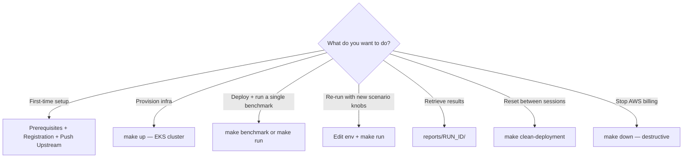

# Run Gateway Benchmark

## Overview

This skill drives the benchmark harness in `scripts/` to measure Flex Gateway throughput,
latency, and resource use under configurable API counts and policies. It provisions a
dedicated EKS cluster, deploys Flex + an upstream echo service, runs a k6 `TestRun`, exports
Grafana dashboards as PNGs, and emits a self-contained Markdown report per run.

Detailed architecture, dashboards, idempotency design, and design rationale are documented
in `references/ARCHITECTURE.md`. Read it before extending the harness; this skill assumes it
as background.



---

## Safety and Cost Guardrails

The harness provisions billable AWS infrastructure (EKS control plane, NAT gateway, EBS
volumes, c6i.2xlarge nodes, ECR). Two operations are destructive and must be confirmed with
the user before executing — never run them autonomously based on inferred intent:

| Operation | Effect | Confirm before running |
|-----------|--------|------------------------|
| `make preflight` | Read-only checks on CLIs, docker daemon, AWS auth, `.env`, registration, and connectivity; reports remediation per gap | No — safe; never mutates state |
| `make prepare-registration` | Generates `.run/registration/registration.yaml` and, when `POLICIES` includes `client-id-enforcement`, prompts for `CLIENT_ID` / `CLIENT_SECRET` and writes them to `.env` (keeps existing values unless `FORCE=1`) | Confirm before re-running with `FORCE=1` (rotates gateway identity, forces a Flex redeploy) |
| `make up` | Creates VPC + EKS + ECR; starts AWS billing | Yes — confirm region, cluster name, and that costs are expected |
| `make down` | Destroys all infra including the cluster, ECR repository contents, and Terraform state references | Yes — confirm the user has retrieved any reports they want to keep |
| `make clean-deployment` | Removes Flex + upstream + k6 TestRuns, keeps cluster | Safe to run between runs; preserves billing-relevant infra |

If `TEARDOWN=1` is set in `.env`, `make benchmark` runs `make down` automatically at the end
of the pipeline. Verify this is the user's intent before invoking `make benchmark` with that
flag set.

---

## Step 1 — Verify prerequisites

All commands run from `skills/omni-gateway/omni-gateway-benchmark/` (where the
`Makefile` lives — the shell scripts the Makefile calls are under `scripts/`).

Run the bundled preflight; it covers every check below in one pass and prints a remediation
command for each gap:

```bash
make preflight
```

What `make preflight` verifies:

- Required CLIs present: `terraform`, `kubectl`, `helm`, `aws`, `docker` (with `buildx`),
  `flexctl`, `curl`, `jq`, `python3`, `envsubst`, `sha256sum`, `shellcheck`.
- Docker engine — client + server versions reported, and `docker info` confirms the daemon
  is reachable on the current context.
- AWS identity (`aws sts get-caller-identity`), the resolved `AWS_PROFILE`, and `AWS_REGION`
  loaded from `.env`.
- `.env` exists and `.run/registration/registration.yaml` is present.
- When `POLICIES` includes `client-id-enforcement`, both `CLIENT_ID` and `CLIENT_SECRET` are
  non-empty.
- Egress to `flex-packages.anypoint.mulesoft.com` (the Helm chart source).

Exits non-zero if any check fails — wire it into your shell pipeline (`make preflight && make
up`) so a missing prerequisite stops the run before AWS billing starts.

The AWS principal must have permissions to create EC2, EKS, VPC, ECR, IAM, and EBS resources
in the target region.

---

## Step 2 — Configure the environment

Copy the example `.env` and fill in scenario knobs:

```bash
cp .env.example .env
```

Edit `.env` based on the scenario the user wants. Reference table — the harness reads every
variable below:

| Variable | Default | Description |
|----------|---------|-------------|
| `AWS_REGION` | `us-east-2` | AWS region for the EKS cluster |
| `CLUSTER_NAME` | `flex-bench` | EKS cluster + VPC name prefix |
| `FLEX_VERSION` | `1.13.0` | Flex Gateway Helm chart and image version |
| `FLEX_IMAGE_REPOSITORY` | `mulesoft/flex-gateway` | Override to use a private mirror |
| `FLEX_IMAGE_TAG` | *(empty → `FLEX_VERSION`)* | Override to decouple tag from version |
| `N_APIS` | `10` | Number of `ApiInstance` resources to create |
| `POLICIES` | `rate-limit,client-id-enforcement` | Comma-list of policies to attach per API |
| `RPS` | `1000` | Target requests per second (constant-arrival-rate) |
| `VUS` | `200` | Pre-allocated k6 virtual users |
| `DURATION` | `2m` | k6 test duration (e.g., `2m`, `5m`) |
| `CLIENT_ID` | *(empty)* | Required when `client-id-enforcement` is in `POLICIES` |
| `CLIENT_SECRET` | *(empty)* | Required when `client-id-enforcement` is in `POLICIES` |
| `GRAFANA_PORT` | `33000` | Local port used by `export-grafana-snapshot.sh` |
| `TEARDOWN` | `0` | Set to `1` to auto-run `make down` after `make benchmark` |
| `REGISTRATION_FILE` | `.run/registration/registration.yaml` | Path to Flex local-mode registration |

**Validation checklist before continuing:**

- If `POLICIES` contains `client-id-enforcement`, both `CLIENT_ID` and `CLIENT_SECRET` are set.
- If `POLICIES=` (empty), no auth headers are required.
- `FLEX_VERSION` matches a chart version published at `flex-packages.anypoint.mulesoft.com/helm`.

---

## Step 3 — Generate the Flex registration artifact (one-time)

The benchmark runs Flex in local mode. Use the bundled target — it generates the artifact
once and, when `POLICIES` includes `client-id-enforcement`, prompts for `CLIENT_ID` /
`CLIENT_SECRET` and writes them into `.env`:

```bash
make prepare-registration
```

Behavior:

- Skips registration generation if `.run/registration/registration.yaml` already exists. To
  rotate the gateway identity (forces a Flex redeploy), re-run with `FORCE=1 make
  prepare-registration` — the existing file is backed up to `*.bak` first.
- Skips the credential prompt unless `POLICIES` contains `client-id-enforcement`.
- Skips overwriting existing non-empty `CLIENT_ID` / `CLIENT_SECRET` unless `FORCE=1`.
- Supports non-interactive use: `CLIENT_ID=... CLIENT_SECRET=... make prepare-registration`.

Manual equivalent (use only if `flexctl` is being driven outside the harness):

```bash
flexctl registration create \
  --connected=false \
  --output-directory=.run/registration
```

Do not commit `.run/registration/registration.yaml` — it is gateway identity material and
`.run/` is gitignored.

---

## Step 4 — Build and push the upstream image (one-time)

The k6 driver hits an in-cluster echo server. The image must exist in ECR before
`deploy-upstream` runs:

```bash
make push-upstream
```

This builds for `linux/amd64` via `docker buildx` (cross-compiling on Apple Silicon) and pushes
to the ECR repository created by Terraform. If `make up` has not yet run, this fails because
the ECR repo does not exist — provision infra first (Step 5).

**Skip condition:** If `make up` has already been run and the upstream image is unchanged,
this step is a no-op. The deploy-upstream hash check will skip redeployment if the rendered
manifest matches the live state.

---

## Step 5 — Provision infrastructure (destructive on AWS billing)

Confirm with the user before running. This creates a VPC, EKS cluster, ECR, and installs the
observability + k6-operator Helm releases:

```bash
make up
```

Expected duration: 15–25 minutes for a fresh cluster. Re-running on an existing cluster is
idempotent and finishes in seconds.

After completion, verify the cluster is reachable:

```bash
aws eks update-kubeconfig --region "$AWS_REGION" --name "$CLUSTER_NAME"
kubectl get nodes
```

You should see two `system` nodes (`t3.large`, tainted) and three `workload` nodes
(`c6i.2xlarge`, `node-role=workload`).

---

## Step 6 — Deploy Flex + upstream

These targets are idempotent and content-addressed via SHA-256 hashes stored as pod template
annotations / Deployment labels. Re-running with unchanged config is a no-op:

```bash
make deploy-upstream    # bench-upstream Service + Deployment in 'default' namespace
make deploy-flex        # Flex Gateway Helm release + CRD resources in 'flex' namespace
```

`deploy-flex` renders `flex-config.yaml` from `assets/config/flex-config-header.yaml` +
`assets/config/snippets/api-instance.yaml` + `assets/config/policies/<policy>.yaml`, hashes it together with
the image reference, and skips `helm upgrade` if the hash matches the live deployment. Config
changes apply via `kubectl apply` to CRDs without restarting Flex pods.

---

## Step 7 — Run the benchmark

A single load test, including report generation:

```bash
make run
```

This sequences: render `scenario.js` → create the per-run ConfigMap → apply the k6 `TestRun`
CRD → poll until `finished` (default timeout 1800s) → port-forward Grafana and export PNGs →
emit the Markdown report.

`RUN_ID` defaults to a UTC timestamp (`20260612T140530Z`). Override it for a stable identifier:

```bash
RUN_ID=baseline-1.13.0-rl make run
```

For the full pipeline (`up` → deploys → `run`, optionally `down` if `TEARDOWN=1`):

```bash
make benchmark
```

**Re-running with different scenario knobs** does not require redeploying:

```bash
RPS=2000 VUS=400 DURATION=5m make run
N_APIS=50 POLICIES= make run            # 50 APIs, no policies
FLEX_VERSION=1.14.0 make deploy-flex && make run
```

If a `TestRun` is already in flight in the `k6-operator-system` namespace, the new run will
fail with a name collision — wait for the previous run to finish or run `make clean-deployment`
to clear stale TestRuns.

---

## Step 8 — Retrieve results

Each run persists artifacts under `reports/<RUN_ID>/`:

| Artifact | Path | Notes |
|----------|------|-------|
| Markdown report | `reports/<RUN_ID>/flex<VERSION>_n<N_APIS>_<POLICIES>_rps<RPS>_<RUN_ID>.md` | Scenario params, raw k6 metrics (`http_reqs`, `http_req_failed`, `http_req_duration`, `checks_succeeded`), Grafana deep-links |
| Dashboard PNGs | `reports/<RUN_ID>/<DashboardTitle>.png` | 1600×900, one per dashboard (Flex / Envoy, Flex / Pods, k6 / Driver, plus default kube-prometheus-stack boards) |

Ephemeral render output lives under `.run/<RUN_ID>/` (`flex-config.yaml`, `scenario.js`,
`flex-values.yaml`, `upstream-deployment.yaml`) and is safe to delete.

To re-export Grafana for the most recent run without re-running k6:

```bash
make report
```

To open Grafana interactively while a run is in flight (anonymous Viewer is
enabled; no login required):

```bash
make watch        # opens port-forward + prints live URLs + opens k6 dashboard
# or, manually:
kubectl -n monitoring port-forward svc/kps-grafana 3000:80
# → http://localhost:3000
```

`make watch` accepts `RUN_ID=<id>` to filter the k6 / Driver dashboard to a
specific run, and `OPEN_BROWSER=0` to skip the auto-open.

---

## Step 9 — Clean up

Two cleanup paths, ordered by aggressiveness:

```bash
make clean-deployment    # Remove Flex + upstream + k6 TestRuns; keep cluster + observability
make down                # terraform destroy — destroys everything (confirm with user first)
```

`clean-deployment` is safe between sessions and preserves the cluster cost (~$0.10/hr for the
EKS control plane plus node-group on-demand pricing). `make down` stops all AWS billing for
this environment but is irreversible — any reports not copied out of `reports/` will remain
locally, but ECR images and cluster state are gone.

---

## Scenario Cookbook

Common parameter combinations:

| Goal | Configuration |
|------|---------------|
| Baseline, no policies | `N_APIS=10 POLICIES= RPS=1000 VUS=200 DURATION=2m` |
| Rate-limit only | `POLICIES=rate-limit RATE_LIMIT_RPS=500` |
| Client-ID enforcement only | `POLICIES=client-id-enforcement CLIENT_ID=... CLIENT_SECRET=...` |
| Both policies, high fan-out | `N_APIS=50 POLICIES=rate-limit,client-id-enforcement RPS=2000 VUS=400 DURATION=5m` |
| Version comparison | Run twice with `FLEX_VERSION=1.13.0` and `FLEX_VERSION=1.14.0`; both `make deploy-flex && make run`; diff the two `reports/<RUN_ID>/*.md` files |

The k6 thresholds in the rendered scenario are hard failures: `http_req_failed < 1%`,
`p(95) < 500ms`, `p(99) < 1000ms`. A run that exceeds them will surface in the report's
`checks_succeeded` line — the harness still completes and reports.

---

## Troubleshooting

| Problem | Likely cause | Fix |
|---------|-------------|-----|
| `make up` fails with `AccessDenied` | AWS principal lacks EKS/VPC/ECR/IAM permissions | Attach a policy granting the missing actions; verify with `aws sts get-caller-identity` |
| `make push-upstream` fails with `repository does not exist` | `make up` not yet run; ECR repo missing | Run `make up` first, then retry `make push-upstream` |
| `deploy-flex` fails pulling the chart | `FLEX_VERSION` not published at the public chart repo | Check `helm search repo flex-gateway/flex-gateway --versions`; pick a published version |
| `make run` blocks past the 1800s timeout | k6 TestRun stuck in `error` or `creating`; missing image; namespace not ready | `kubectl -n k6-operator-system get testruns,pods`; inspect `kubectl describe testrun <name>` |
| Report missing PNGs | Grafana port-forward race or image-renderer plugin unavailable | Re-run `make report`; if persistent, check `kubectl -n monitoring logs deploy/kps-grafana` for the renderer container |
| `client-id-enforcement` returns 401 on every request | `CLIENT_ID` / `CLIENT_SECRET` empty or do not match a Contract resource | Set both in `.env`; verify the Contract resource exists for the API instance |
| Flex pod in `CrashLoopBackOff` after `deploy-flex` | Missing or stale `flex-registration` secret | Regenerate via `flexctl registration create --connected=false`; rerun `make deploy-flex` |
| `bench/spec-hash` annotation never updates | Hash collision (rare) or annotation patch failed | Force redeploy: `kubectl -n flex annotate deploy flex-gateway bench/spec-hash- --overwrite` then `make deploy-flex` |
| `RUN_ID` collision causes TestRun apply to fail | Previous TestRun with same `RUN_SLUG` still in the namespace | `make clean-deployment` or `kubectl -n k6-operator-system delete testrun <name>` |

For deeper triage of the gateway itself (not the harness), invoke `omni-gateway-logs` or
`omni-gateway-diagnose`.

---

## Available Scripts

The `make` targets above are the supported entry points. They delegate to the scripts in
`scripts/`, listed here for reference when debugging the harness or composing steps manually.
Every script reads its configuration from `.env` and accepts `--help` for usage:

| Script | Driven by | Purpose |
|--------|-----------|---------|
| `preflight.sh` | `make preflight` | Read-only check of every CLI, daemon, credential, and one-time artifact before any run |
| `prepare-registration.sh` | `make prepare-registration` | Generate the local-mode Flex registration artifact; collect `CLIENT_ID`/`CLIENT_SECRET` when needed |
| `push-upstream.sh` | `make push-upstream` | Build the upstream echo image for `linux/amd64` and push to ECR |
| `deploy-upstream.sh` | `make deploy-upstream` | Deploy (or hash-skip) the `bench-upstream` Service + Deployment |
| `deploy-flex.sh` | `make deploy-flex` | Render config, then deploy (or hash-skip) the Flex Gateway Helm release + CRDs |
| `render-flex-config.sh` | `deploy-flex.sh` | Assemble `flex-config.yaml` from header + API-instance + policy snippets |
| `wait-for-flex.sh` | `deploy-flex.sh` | Block until the Flex Gateway deployment finishes rolling out |
| `render-k6-script.sh` | `run-bench.sh` | Render the k6 `scenario.js` from scenario knobs |
| `run-bench.sh` | `make run` | Create the per-run k6 `TestRun`, wait for it, and export the Grafana snapshot |
| `wait-for-testrun.sh` | `run-bench.sh` | Poll a k6 `TestRun` until it reaches `finished` (or times out) |
| `export-grafana-snapshot.sh` | `run-bench.sh` | Port-forward Grafana and export dashboard PNGs for a time window |
| `generate-report.sh` | `make run` | Parse k6 summary from runner logs and emit the per-run Markdown report |
| `watch-grafana.sh` | `make watch` | Open a Grafana port-forward and print live dashboard URLs |
| `clean-deployment.sh` | `make clean-deployment` | Tear down per-run workloads while keeping the cluster, observability, and k6-operator |

---

## Related Jobs

- `omni-gateway-install` — install Flex on Linux/Docker/Kubernetes (this skill provisions its
  own EKS install for benchmarking; use `omni-gateway-install` for production deployments)
- `omni-gateway-config` — validate the rendered `flex-config.yaml` before `make deploy-flex`
- `omni-gateway-logs` — parse Flex pod logs when a benchmark surfaces unexpected failures
- `omni-gateway-diagnose` — triage non-harness gateway issues observed during a run
