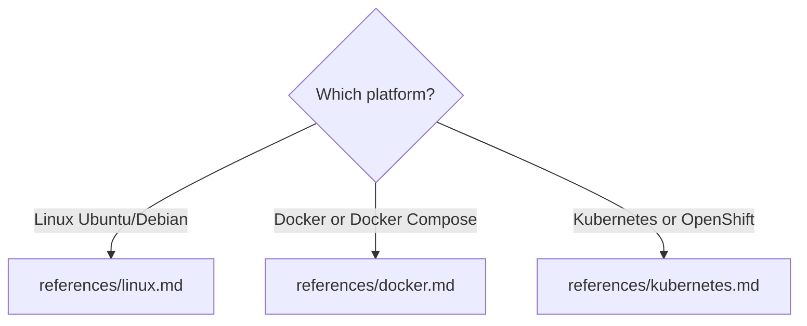

# Install Omni Gateway

## Choose Your Platform

Pick the target platform, then read the matching reference file for the full step-by-step
walkthrough. Each reference covers both connected mode (registered with Anypoint Platform) and
local mode (standalone).



| Platform | Read | Covers |
|----------|------|--------|
| Linux (Ubuntu/Debian, APT) | `references/linux.md` | APT repo setup, `flex-gateway` package, systemd service |
| Docker / Docker Compose | `references/docker.md` | Image pull, `docker run` and Compose, conf.d bind mount |
| Kubernetes / OpenShift (Helm) | `references/kubernetes.md` | Helm repo, `values.yaml`, OpenShift SCC settings |

> RHEL, CentOS, and Amazon Linux are not covered by the APT instructions. Contact the MuleSoft
> gateway team for RPM repository details — do not use the APT repository on RPM-based systems.

After completing the platform walkthrough, return here for connected-mode verification and
troubleshooting.

---

## Connected mode vs. local mode

All three platforms support two modes; pick before you start:

- **Connected mode** — the gateway registers with Anypoint Platform and appears in Runtime
  Manager. Requires an organization ID and a registration token (expires 24 hours after issue).
- **Local mode** — the gateway runs standalone with no control-plane connection. Skip the
  registration step in the platform reference.

Each platform reference spells out which steps to skip for local mode.

---

## Confirm in Anypoint Runtime Manager (connected mode)

After installation and registration, verify that the gateway is online.

### Option 1: Anypoint Platform UI

1. Navigate to **Anypoint Platform** → **Runtime Manager** → **Flex Gateways**
2. Find your gateway by name
3. Confirm the status shows **STARTED** (green indicator)

### Option 2: Flex Gateway Manager API

```
GET https://anypoint.mulesoft.com/flexgateway/api/v1/organizations/{orgID}/environments/{envID}/gateways/{gatewayID}
Authorization: Bearer <access-token>
```

Expect a 200 response with `"status": "STARTED"`.

---

## Troubleshooting

| Problem | Likely Cause | Fix |
|---------|-------------|-----|
| `authentication failed` or `401 Unauthorized` | Token expired or belongs to a different organization | Generate a fresh token from Runtime Manager → Add Gateway → Self-managed, then re-run registration |
| `environment not found` or `404` | Organization ID wrong or token scoped to a different organization | Verify org ID in Anypoint Admin Settings and regenerate token in the correct organization |
| `permission denied` or `conf.d not writable` | Output directory has restrictive permissions | Run `sudo chown -R $USER /usr/local/share/mulesoft/flex-gateway/conf.d` (Linux) or adjust volume permissions (Docker/Kubernetes) |
| `409 Conflict` — gateway already registered | A gateway with this name already exists in Anypoint | Use a different `<gateway-name>` or delete the old record from Runtime Manager |
| Status stays `DISCONNECTED` after restart | Registration file not in conf.d, or gateway using wrong conf.d path | Verify with `ls -la /usr/local/share/mulesoft/flex-gateway/conf.d/`; for Docker/Kubernetes check volume mount path |
| `flexctl: command not found` (Linux) | `flexctl` is not in `$PATH` | Reinstall flex-gateway or add the installation directory to `$PATH` |
| Container exits immediately (Docker) | Missing or malformed `registration.yaml`, permissions mismatch on `conf.d/`, or port in use | Run `docker logs flex-gateway` to see the error |
| `bind: address already in use` | Another process is listening on the mapped port | Change the host-side port (e.g., `-p 18081:8081`) or stop the conflicting process |
| `ImagePullBackOff` (Kubernetes) | Node cannot reach Docker Hub or image tag does not exist | Check network egress rules; confirm tag with `docker pull mulesoft/flex-gateway:<tag>` |
| `CrashLoopBackOff` (Kubernetes) | Missing registration secret, malformed ConfigMap YAML, or OpenShift SCC violation | Run `kubectl logs -n gateway deployment/ingress` |
| `Pending` pods (Kubernetes) | Resource quota or node affinity issues | Run `kubectl describe pod -n gateway` |

---

## Next Steps After Installation

Once the gateway is installed and running:

1. **Apply a policy to an API** — configure API proxying and security: see `secure-api`.
2. **Monitor logs** — parse and interpret gateway log output: see `omni-gateway-logs`.
3. **Validate your conf.d configuration** — check YAML resource files for misconfigurations
  before deploying changes: see `omni-gateway-config`.

---

## Related Jobs

- `omni-gateway-config` — Validate conf.d YAML configuration
- `omni-gateway-logs` — Parse and interpret gateway log output
- `omni-gateway-diagnose` — End-to-end triage when the gateway returns errors
